# 🌐 Module 01 — Networking Today

**Course:** Networking Basics

> **🎯 Module Goal**
>
> This module builds the foundation of networking by explaining why networks matter, what the Internet really is, how data is represented and transmitted, and how network performance is measured. It prepares you for every later CCNA topic by making sure the basic vocabulary and mental models are solid before moving on to devices like routers and switches.

---

## 📑 Table of Contents

| # | Topic | Key Areas |
|---|-------|-----------|
| 1 | [Communications in a Connected World](#-topic-1--communications-in-a-connected-world) | Networks, Internet, ISPs, Network Types |
| 2 | [Connected Home Devices & IoT](#-topic-2--connected-home-devices--other-connected-devices-iot) | Smart Devices, Sensors, Actuators, RFID |
| 3 | [Data Transmission](#-topic-3--data-transmission) | Bits, Bytes, ASCII, Signals, Personal Data |
| 4 | [Bandwidth and Throughput](#-topic-4--bandwidth-and-throughput) | Bandwidth, Throughput, Latency, Units |
| 🏁 | [Module Summary](#-module-summary-sections-141142) | Redundancy, Key Terms, Quick Revision |

---

## 📡 Overview

- This module covers: why networking matters, types and sizes of networks, IoT and everyday connected devices, how data is represented and transmitted, and how bandwidth/throughput/latency describe network performance.
- It matters because almost every modern activity — messaging, streaming, banking, healthcare, gaming — depends on networks working correctly.
- In real networking, this foundation is used every time you choose a network size for a client (home vs SOHO vs enterprise), explain to a customer why their Internet feels "slow" even on a fast plan, or decide whether to use copper, fiber, or wireless for a connection.

---

# 🔗 Topic 1 – Communications in a Connected World

## 💡 What is it?

Before learning routers, switches, or IP addresses, this topic answers one question: **why should anyone care about networking?** The answer is that nearly everything done on a phone or computer today — messaging, video calls, maps, shopping, banking — relies on networks. This topic introduces the Internet as a **"network of networks"** with no single owner, and shows that networks come in different sizes (home, SOHO, enterprise, worldwide) and connect far more than just computers.

## ❓ Why do we need it?

If every device worked alone, a laptop couldn't browse the web, send email, use cloud storage, or play multiplayer games. Networking solves this by letting devices communicate, share resources, and exchange information with anyone, anywhere. Without networking, there is no Internet.

## ⚙️ How does it work?

At a high level, a message travels through several stages to reach its destination:

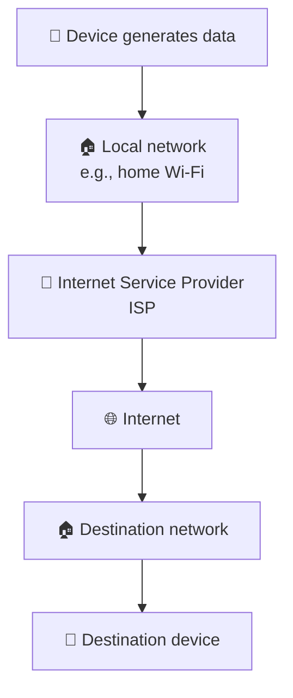

**Example – sending a WhatsApp message:**

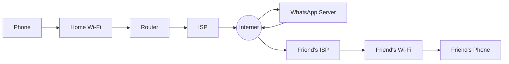

## 🧩 Key Components

- **Protocols** – common rules that let different devices and networks communicate regardless of manufacturer or location (described as networking's "universal language").
- **ISP (Internet Service Provider)** – connects a local network to the wider Internet.
- **Local network** – the small network inside a home, office, or building.
- **Servers** – deliver applications and services (e.g., gaming, video call, email servers).

## 📋 Types

Networks are grouped by size and purpose:

### 🏠 Small Home Network

- **Definition:** A network connecting a handful of personal devices in a house.
- **Characteristics:** Typically 2–10 devices; all connected through one home Wi-Fi router.
- **Example:** Laptop, phone, smart TV, and printer sharing one router.

### 🏢 SOHO (Small Office/Home Office)

- **Definition:** A small-scale business or home-office network.
- **Characteristics:** Typically 10–50 devices; used by freelancers, doctors, lawyers, and small businesses; shares printers, files, and Internet access.
- **Example:** A small clinic where staff share one printer and one Internet connection.

### 🏫 Medium to Large Network

- **Definition:** A network serving an organization with many users.
- **Characteristics:** Hundreds to thousands of devices; common in schools, colleges, companies, and factories; often spans multiple floors or buildings.
- **Example:** A college campus network connecting every classroom building.

### 🌍 World Wide Network

- **Definition:** Networks connected across cities, countries, and continents.
- **Characteristics:** The Internet is the largest example; built from millions of independently owned networks agreeing to use the same protocols.
- **Example:** A user in India watching a video hosted on a server in another country.

## 🖼️ Diagram Explanation

**Internet Communication Diagram:**

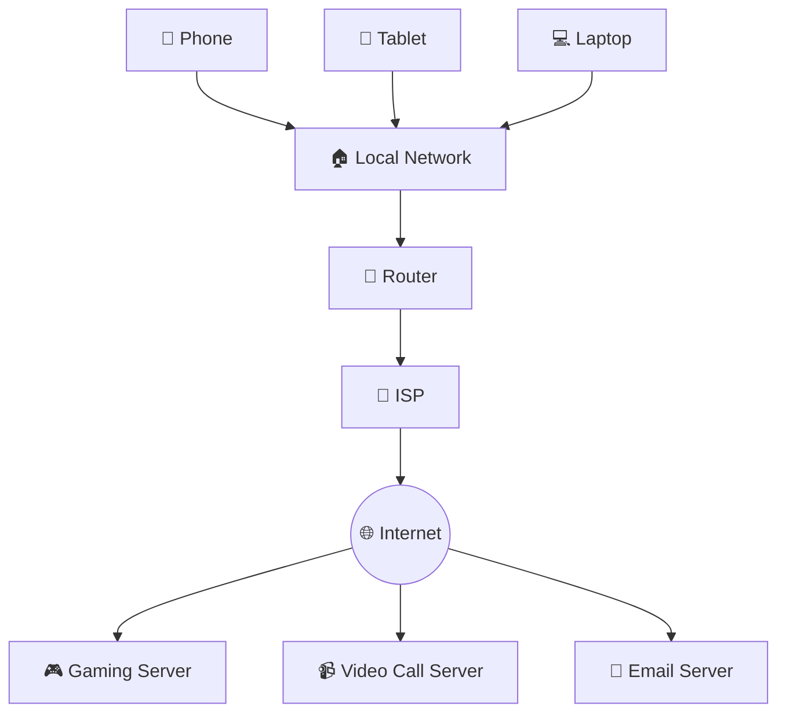

- **End devices** (phone, laptop, tablet) generate and receive data.
- **Local network** connects nearby devices to each other.
- **Router** connects the local network to the ISP.
- **ISP** provides Internet connectivity.
- **Internet** carries data between networks worldwide.
- **Servers** deliver the actual applications and services.

> [!NOTE]  
> **🔄 Communication sequence:** the device creates data → it reaches the local router → the router forwards it to the ISP → the ISP sends it across the Internet → the destination server/device receives it → a reply follows the reverse path.

## 🌍 Real-Life Example

A student's college Wi-Fi connects through college switches and a router to the Internet, which lets every student reach Google, YouTube, ChatGPT, and cloud storage — all through one shared campus network.

## 📌 Important Facts

> [!IMPORTANT]
> - A network connects devices so they can communicate and share resources.
> - The Internet is the world's largest network of interconnected networks — a **"network of networks."**
> - No single person or company owns the Internet; it is decentralized and made of millions of independent networks agreeing to use common protocols.
> - Bandwidth and throughput (covered later) are introduced here conceptually: **bandwidth** is the maximum network capacity, while **throughput** is the actual speed experienced.
> - Modern "connected" devices go far beyond computers: smartphones, tablets, smartwatches, and smart glasses are everyday examples, and many of these qualify as IoT devices.

## ⚠️ Common Beginner Mistakes

> [!WARNING]
> - **Mistake:** Thinking "Internet" and "network" mean the same thing.
>   **Correct understanding:** The Internet is one very large network made up of many smaller networks.
> - **Mistake:** Assuming only computers use networks.
>   **Correct understanding:** Phones, TVs, printers, watches, cameras, and sensors all use networks too.
> - **Mistake:** Believing someone owns the entire Internet.
>   **Correct understanding:** The Internet is decentralized; many organizations operate interconnected networks using shared standards.
> - **Mistake:** Thinking Wi-Fi *is* the Internet.
>   **Correct understanding:** Wi-Fi only connects a device to a local network; Internet access comes through the router and ISP.

## 📊 Comparisons

| Feature | 🏠 Small Home Network | 🏢 SOHO | 🏫 Medium/Large Network | 🌍 World Wide Network |
|---|---|---|---|---|
| Typical device count | 2–10 | 10–50 | Hundreds–thousands | Millions+ |
| Typical users | Family | Freelancers, small business | Schools, companies, factories | Global |
| Example | Home Wi-Fi router | Clinic, small office | College campus | The Internet |

## 📖 Key Terms

| Term | Meaning |
|---|---|
| 🔗 Network | A group of connected devices that can communicate and share resources |
| 🌐 Internet | A global "network of networks" with no single owner |
| 📜 Protocol | A common rule that lets different devices communicate |
| 🏢 ISP | Internet Service Provider; connects a local network to the Internet |
| 🏠 SOHO | Small Office/Home Office network |

---

# 🏠 Topic 2 – Connected Home Devices & Other Connected Devices (IoT)

## 💡 What is it?

Beyond laptops and phones, many ordinary objects — security cameras, smart TVs, refrigerators, washing machines, cars, medical devices, farm sensors, and RFID tags — can also connect to a network and send, receive, or process data. This collection of Internet-connected physical devices is called the **Internet of Things (IoT)**.

> [!TIP]
> **📌 IoT:** A network of physical devices connected to the Internet that can collect data, communicate, and often be monitored or controlled remotely.

## ❓ Why do we need it?

IoT lets people check on their home, monitor elderly relatives' health, automate plant watering, and receive alerts — all remotely. Networking enables devices to communicate automatically, send alerts, share information, be controlled remotely, improve safety, and reduce manual work.

## ⚙️ How does it work?

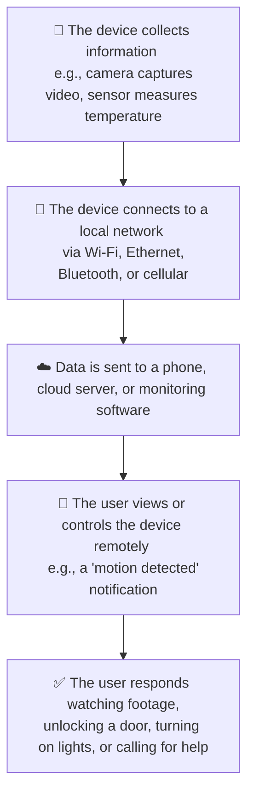

## 🧩 Key Components

- **🔍 Sensor:** Detects or measures something (temperature, motion, soil moisture). A sensor only collects information — think of it as the system's *eyes*.
- **🤖 Actuator:** Performs an action based on instructions (turns on a motor, opens a valve, unlocks a door) — think of it as the system's *hands*.
- **🔀 Router:** Connects smart devices to the Internet.
- **☁️ Cloud platform:** Stores, processes, and manages device data.
- **📱 Mobile app:** Lets the user monitor and control devices remotely.

## 📋 Types

### 🏠 Home IoT Devices

- **📹 Security systems:** Cameras stream live video, detect motion, and send notifications for remote viewing.
- **🧊 Smart appliances:** Refrigerators, washing machines, and ovens that report status, send maintenance alerts, and can be controlled remotely.
- **📺 Smart TVs:** Networked computers that stream content, browse the web, and access cloud services without cable TV.
- **🎮 Gaming consoles:** Use networking to download games, play multiplayer, chat, and save progress to the cloud.

### 🌐 Other Connected Devices

- **🚗 Smart cars:** Use networking for GPS navigation, live traffic, emergency assistance, theft alerts, diagnostics, and software updates; an airbag deployment can automatically contact emergency services.
- **🏷️ RFID tags (Radio Frequency Identification):** Small electronic tags that communicate via radio waves to identify and track items without direct contact — used in retail, warehouses, libraries, ID cards, tolls, and baggage tracking.
- **🌡️ Sensors and actuators:** Used heavily in agriculture and industry (see Process below).
- **🏥 Medical devices:** Hospital monitors, pacemakers, and insulin pumps let doctors track vitals remotely and receive emergency alerts.

## 🖼️ Diagram Explanation

**📹 Security camera example:**

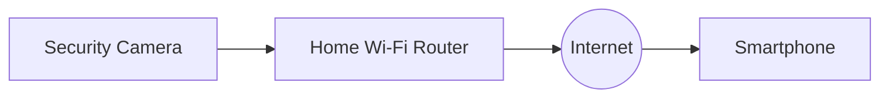

**🧊 Smart appliance example:**

**🏷️ RFID example:**

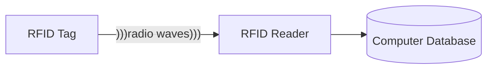

**🌐 General IoT communication flow:**

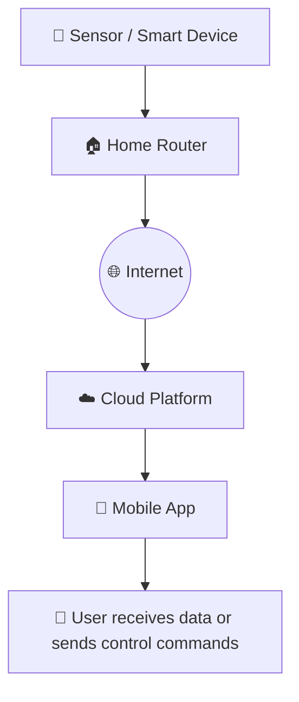

> [!NOTE]  
> **🔄 Communication sequence:** the device collects data or waits for commands → sends data through the local network → the Internet carries it to a cloud service → the cloud forwards it to the user's app → the user views status or sends control commands back.

## 🌍 Real-Life Example

While away from home, a person can check a smart camera, smart TV, smart refrigerator, smart lights, smart door lock, and smart washing machine — all through their phone, via the Internet and home Wi-Fi router.

**🌾 Agricultural sensor/actuator process:**

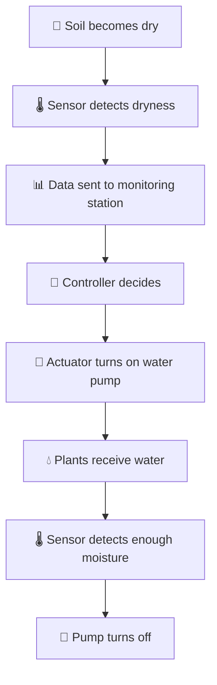

> [!NOTE]
> This entire cycle happens **automatically**.

## 📌 Important Facts

> [!IMPORTANT]
> - IoT stands for **Internet of Things**.
> - IoT devices are physical objects connected to the Internet that collect, send, or receive data.
> - Home IoT examples: security systems, smart appliances, smart TVs, gaming consoles.
> - Other IoT examples: smart cars, RFID systems, sensors, actuators, medical devices.
> - Sensors gather information; actuators perform actions.
> - RFID uses radio waves and often doesn't require direct line-of-sight, unlike a barcode.

## ⚠️ Common Beginner Mistakes

> [!WARNING]
> - **Mistake:** Assuming every electronic device is an IoT device.
>   **Correct understanding:** A device is part of IoT only if it can communicate over a network.
> - **Mistake:** Treating sensors and actuators as the same thing.
>   **Correct understanding:** A sensor detects or measures; an actuator performs an action.
> - **Mistake:** Assuming smart TVs only watch Internet videos.
>   **Correct understanding:** Smart TVs are networked computers capable of running apps, browsing the web, and receiving updates.
> - **Mistake:** Confusing RFID with a barcode.
>   **Correct understanding:** RFID uses radio waves and often doesn't need direct line-of-sight, while barcodes must be visually scanned.

## 📖 Key Terms

| Term | Meaning |
|---|---|
| 🌐 IoT | Internet of Things — physical devices connected to the Internet |
| 🔍 Sensor | A device that detects or measures something (the system's "eyes") |
| 🤖 Actuator | A device that performs an action based on instructions (the system's "hands") |
| 🏷️ RFID | Radio Frequency Identification — tags that use radio waves to identify/track items |
| ☁️ Cloud platform | A remote service that stores and processes device data |

### 🧠 Memory Tip – IoT as a Smart Human Body

| Human Body | IoT Equivalent |
|---|---|
| 👀 Eyes | Sensors |
| 🧠 Brain | Cloud / Controller |
| 🤲 Hands | Actuators |
| 🧬 Nervous System | Network |
| 🗣️ Voice | Notifications |

---

# 💾 Topic 3 – Data Transmission

## 💡 What is it?

Computers don't understand English, images, or video — they only understand two symbols, **0** and **1**, called **bits**. Every piece of data is eventually converted into billions of bits, which are then converted into signals so they can travel through cables or through the air.

## ❓ Why do we need it?

Humans communicate with letters, pictures, and sounds, but computers only understand 0s and 1s. Everything must be translated into binary before it can be transmitted across a network, the same way two people speaking different languages need translation to communicate.

## ⚙️ How does it work?

**Sending the word "HELLO":**

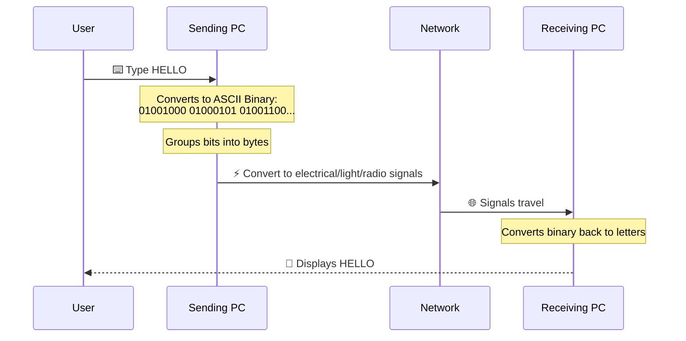

## 🧩 Key Components

- **🔢 Bit:** The smallest unit of data; only two possible values, 0 or 1, matching a circuit being OFF or ON.
- **📦 Byte:** A group of 8 bits, usually storing one character in ASCII.
- **🔤 ASCII (American Standard Code for Information Interchange):** Gives every character a unique binary value, e.g. A = 01000001, B = 01000010, 9 = 00111001, # = 00100011.
- **⌨️ Input devices** (keyboard, mouse, microphone, webcam): convert human actions into binary.
- **🖥️ Output devices** (monitor, printer, speaker): convert binary back into something humans understand.

## 📋 Types

### 🔒 Personal Data Types

**📝 Volunteered Data**
- **Definition:** data intentionally provided by the user.
- **Characteristics:** the person knows the information is being shared.
- **Example:** typing your name, email, and phone number into a sign-up form.

**🔎 Inferred Data**
- **Definition:** data a company learns from behavior, even without being told directly.
- **Characteristics:** derived from patterns rather than stated facts.
- **Example:** a bank inferring a customer traveled because their card was used in a different city, without being informed directly.

**📍 Observed Data**
- **Definition:** information collected automatically.
- **Characteristics:** gathered passively, e.g. through sensors or location services.
- **Example:** a phone automatically sending its current location to a carrier's database.

### 📡 Data Transmission Methods

**⚡ Electrical Signals**
- **Definition:** binary converted into electrical pulses.
- **Characteristics:** used on copper Ethernet cables; cheap, common, and easy to install, but limited distance and susceptible to electrical interference.
- **Example:** a wired Ethernet connection between two computers.

**💡 Optical Signals**
- **Definition:** binary converted into pulses of light.
- **Characteristics:** used on fiber-optic cables; very fast, long distance, immune to electromagnetic interference, and high bandwidth, but more expensive and requires specialized equipment.
- **Example:** a fiber backbone connecting two buildings.

**📶 Wireless Signals**
- **Definition:** binary converted into radio waves.
- **Characteristics:** used in Wi-Fi, Bluetooth, and cellular (4G/5G); offers mobility and easy installation, but can suffer interference and is generally slower than fiber.
- **Example:** a laptop connecting to a router over Wi-Fi.

## 🖼️ Diagram Explanation

The same binary data can travel over three different media — only the carrying method changes:

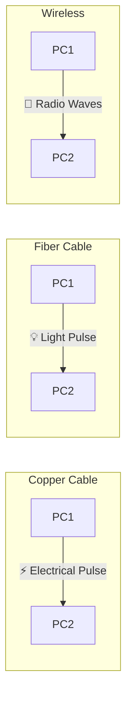

**Overall data transmission process:**

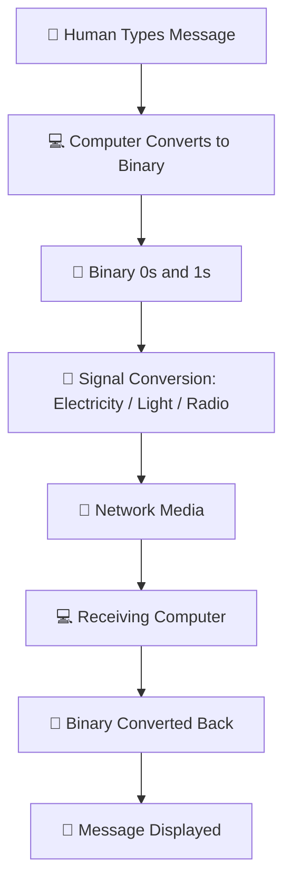

## 🌍 Real-Life Example

Sending a selfie over Wi-Fi: the photo becomes millions of bits, the phone converts them into radio waves, the router converts them into electrical or optical signals, the ISP forwards them, and the friend's phone converts the signals back into the original photo — even though only 0s and 1s ever traveled across the network.

## 📌 Important Facts

> [!IMPORTANT]
> - A bit is the smallest unit of data and can only be 0 or 1.
> - 8 bits = 1 byte.
> - ASCII maps characters to unique binary values.
> - Copper cable carries electrical pulses; fiber-optic cable carries light pulses; wireless carries radio waves.
> - Personal data is categorized as volunteered, inferred, or observed.

## ⚠️ Common Beginner Mistakes

> [!WARNING]
> - **Mistake:** Thinking a bit and a byte are the same.
>   **Correct understanding:** A bit is one binary digit; a byte is a group of 8 bits.
> - **Mistake:** Believing computers store letters directly.
>   **Correct understanding:** Computers store only binary representations of letters (e.g., ASCII or Unicode).
> - **Mistake:** Assuming wireless data isn't binary.
>   **Correct understanding:** Wireless still carries binary data — it just uses radio waves instead of electrical or light signals.
> - **Mistake:** Thinking fiber sends electricity.
>   **Correct understanding:** Fiber transmits light pulses, not electrical current.
> - **Mistake:** Confusing inferred data with volunteered data.
>   **Correct understanding:** Inferred data is derived from behavior; volunteered data is intentionally provided.

## 📊 Comparisons

**Transmission Methods:**

| Feature | ⚡ Electrical (Copper) | 💡 Optical (Fiber) | 📶 Wireless |
|---|---|---|---|
| Signal type | Electrical pulses | Light pulses | Radio waves |
| Speed/distance | Moderate, limited distance | Very fast, long distance | Varies, moderate distance |
| Interference | Susceptible to electrical interference | Immune to electromagnetic interference | Can suffer interference |
| Cost | Cheap | Expensive | Moderate |

**Personal Data Types:**

| Data Type | Who Provides It | Example |
|---|---|---|
| 📝 Volunteered | The user, intentionally | Filling out a sign-up form |
| 🔎 Inferred | Derived from behavior | Bank noticing card used in a new city |
| 📍 Observed | Collected automatically | GPS location sent without manual entry |

## 📖 Key Terms

| Term | Meaning |
|---|---|
| 🔢 Bit | Smallest unit of data; either 0 or 1 |
| 📦 Byte | A group of 8 bits |
| 🔤 ASCII | A standard that maps characters to binary values |
| 📝 Volunteered data | Data the user intentionally provides |
| 🔎 Inferred data | Data derived from a user's behavior |
| 📍 Observed data | Data collected automatically |

> [!TIP]
> ### 🧠 Memory Tip – "ELR"
> - **E**lectrical (Copper) ⚡
> - **L**ight (Fiber) 💡
> - **R**adio (Wireless) 📡

---

# 📈 Topic 4 – Bandwidth and Throughput

## 💡 What is it?

Like a highway where the number of lanes limits how many cars *can* travel while actual traffic determines how many cars *do* travel, a network has a maximum capacity (**bandwidth**) and an actual achieved speed (**throughput**).

> [!NOTE]
> 🛣️ Bandwidth  = Maximum Capacity  
> 🚗 Throughput = Actual Performance

## ❓ Why do we need it?

Having a high-speed Internet plan doesn't guarantee that speed will always be experienced in practice. Networking engineers measure both the maximum possible capacity and the real-world speed so that performance problems can be understood and explained correctly.

## ⚙️ How does it work?

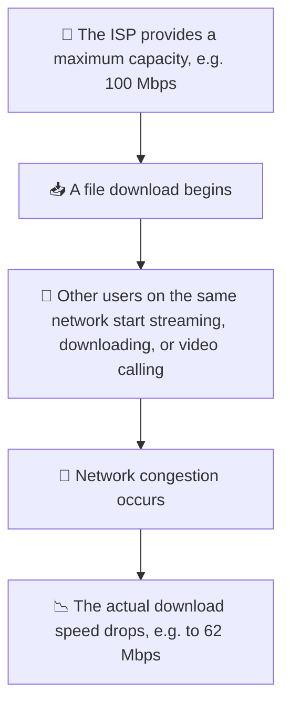

> [!NOTE]  
> **Result:** Bandwidth = 100 Mbps, Throughput = 62 Mbps — nothing is broken; the network simply couldn't deliver its full theoretical capacity under load.

## 🧩 Key Components

- **🛣️ Bandwidth:** The maximum amount of data that can be transferred across a network in a given time.
- **🚗 Throughput:** The actual amount of data successfully transferred over a period of time.
- **⏱️ Latency:** The time delay for data to travel from source to destination.
- **📏 Units:** bps, Kbps, Mbps, Gbps, Tbps — each step 1000× larger than the previous one.

## 📋 Types

### 🛣️ Factors Affecting Bandwidth

- **Physical media:** e.g. fiber cable has much higher bandwidth than copper cable.
- **Technology:** e.g. Wi-Fi 6 is faster than Wi-Fi 4.
- **Laws of physics:** distance, electrical interference, and signal loss all reduce available bandwidth.

### 🚗 Factors Affecting Throughput

- **Network traffic:** more simultaneous users mean a smaller share of capacity for each.
- **Data type:** encrypted traffic, video, and voice require different processing.
- **Latency:** higher latency (e.g. India → USA vs India → Mumbai) often reduces throughput.
- **Network devices:** every router, switch, firewall, or server adds processing delay.
- **Slowest link rule:** end-to-end throughput cannot exceed the capacity of the weakest link in the path — e.g. 1 Gbps → 1 Gbps → 100 Mbps → 1 Gbps results in a maximum throughput of 100 Mbps.

## 🖼️ Diagram Explanation

**🛣️ Highway analogy:**

- Maximum cars possible → 🛣️ **Bandwidth**
- Cars actually moving today → 🚗 **Throughput**

**🌐 Network communication path:**

> [!NOTE]  
> Each device introduces a small delay, and overall throughput cannot exceed the capacity of the slowest connection in the path.

## 🌍 Real-Life Example

A water pipe that can carry 100 liters per minute (bandwidth) might only deliver 70 liters per minute (throughput) due to dirt, low pressure, or partially closed valves. A speed-test website similarly measures real download/upload throughput — e.g. 35.70 Mbps download and 35.04 Mbps upload — which is usually lower than the advertised plan because ISPs often allocate more capacity to downloads than uploads.

## 📌 Important Facts

> [!IMPORTANT]
> - Bandwidth is the maximum data transfer capacity; throughput is the actual achieved rate.
> - Bandwidth is measured in bits per second (bps), with common units Kbps, Mbps, Gbps, and Tbps.
> - 8 bits = 1 byte, so Mbps (megabits per second) and MB/s (megabytes per second) are different: 100 Mbps ÷ 8 = 12.5 MB/s.
> - Throughput is usually lower than bandwidth due to congestion, latency, processing, and protocol overhead.
> - The slowest link in a communication path determines the maximum end-to-end throughput.
> - Download speed is for receiving data; upload speed is for sending data.

## ⚠️ Common Beginner Mistakes

> [!WARNING]
> - **Mistake:** Treating bandwidth and throughput as the same thing.
>   **Correct understanding:** Bandwidth is the maximum possible rate; throughput is the actual achieved rate.
> - **Mistake:** Assuming Mbps means megabytes per second.
>   **Correct understanding:** Mbps = megabits per second; MB/s = megabytes per second (8× difference).
> - **Mistake:** Believing a 1 Gbps Internet plan guarantees 1 Gbps downloads.
>   **Correct understanding:** Real-world throughput depends on server capacity, Wi-Fi quality, congestion, and device performance.
> - **Mistake:** Assuming every network segment always runs at its highest speed.
>   **Correct understanding:** End-to-end performance is limited by the slowest link in the path.

## 📊 Comparisons

| Feature | 🛣️ Bandwidth | 🚗 Throughput |
|---|---|---|
| Definition | Maximum possible capacity | Actual data transferred |
| Changes over time? | Fixed (depends on media/technology) | Varies continuously |
| Affected by congestion? | No | Yes |
| Example | 100 Mbps plan | 62 Mbps actual download |

## 📖 Key Terms

| Term | Meaning |
|---|---|
| 🛣️ Bandwidth | Maximum amount of data a network can carry in a given time |
| 🚗 Throughput | Actual amount of data successfully transferred |
| ⏱️ Latency | Time delay for data to travel from source to destination |
| 📏 bps / Kbps / Mbps / Gbps / Tbps | Units of bandwidth, each 1000× the previous |
| ⛓️ Slowest link rule | End-to-end throughput is capped by the weakest link in the path |

> [!TIP]
> ### 🧠 Memory Tip
> - **B**andwidth = **B**iggest possible.
> - **T**hroughput = **T**rue speed you experience.

---

# 🏁 Module Summary (Sections 1.4.1–1.4.2)

The end of Module 1 ties the three major topics together and introduces one key engineering principle: **redundancy and fault tolerance**.

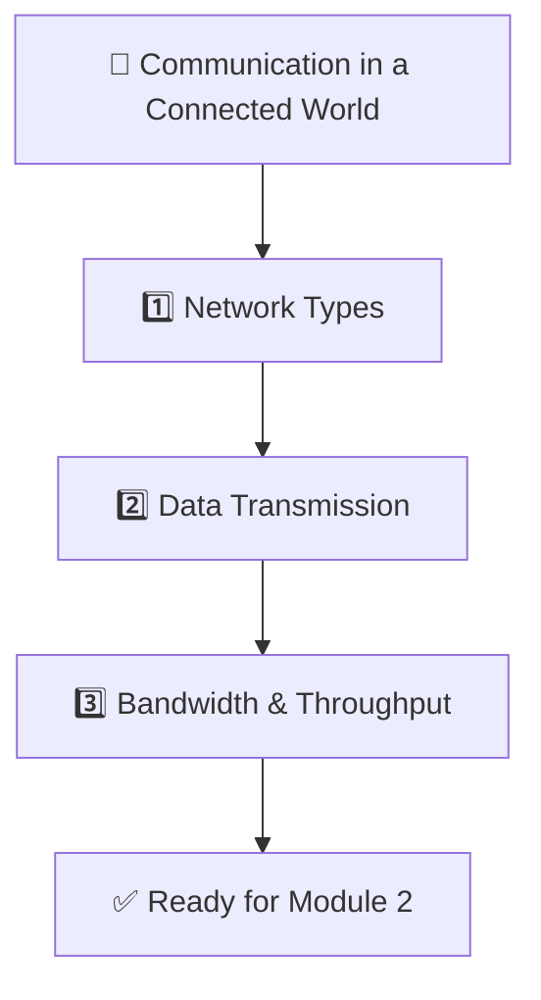

> [!NOTE]  
> **🕸️ Redundancy concept:** the Internet is compared to a spider web — if one thread (path) breaks, the rest of the web continues supporting the structure, because data can often be redirected through another path. Example: a college with two ISPs can automatically switch traffic to the second ISP if the first fails, so students keep accessing services with little or no interruption.

## 📖 Key Terms (Module-wide)

| Term | Meaning |
|---|---|
| 🔗 Network | A group of connected devices that communicate and share resources |
| 🌐 Internet | A global network of networks with no single owner |
| 🏠 IoT | Internet of Things — everyday physical devices connected to a network |
| 🔢 Bit / Byte | Smallest unit of data (0/1) and a group of 8 bits |
| 🛣️ Bandwidth | Maximum network capacity |
| 🚗 Throughput | Actual achieved network speed |
| ⏱️ Latency | Delay in data travel time |
| 🕸️ Redundancy | Multiple paths so a network keeps working if one part fails |

## 🔄 Quick Revision

- A network connects devices so they can communicate and share resources.
- The Internet is a global **network of networks** with no single owner.
- Networks come in four common sizes: small home, SOHO, medium/large, and worldwide.
- Modern networks connect far more than computers — phones, TVs, watches, and sensors all participate.
- IoT (Internet of Things) refers to everyday physical devices that connect to the Internet to collect or act on data.
- Sensors detect or measure information; actuators perform actions — *"sensor = eyes, actuator = hands."*
- Personal data is volunteered (given intentionally), inferred (derived from behavior), or observed (collected automatically).
- A **bit** is the smallest unit of data and can only be 0 or 1; 8 bits = 1 byte.
- ASCII assigns a unique binary value to each character.
- Data travels as electrical pulses (copper), light pulses (fiber), or radio waves (wireless).
- **Bandwidth** is the maximum possible network capacity; **throughput** is the actual data rate achieved.
- Mbps (megabits per second) is not the same as MB/s (megabytes per second) — they differ by a factor of 8.
- Throughput is reduced by congestion, latency, data type, and the number of intermediate devices.
- The **slowest link** in a path caps the maximum end-to-end throughput.
- Real networks are designed with **redundancy** so they keep working even if one path or device fails.

## 📝 Module Summary

- **Main concepts learned:** what a network is and why it matters; the different sizes of networks and the rise of IoT; how data is represented in binary and transmitted as electrical, optical, or wireless signals; and how bandwidth, throughput, and latency describe network performance.
- **Skills gained:** the ability to distinguish bandwidth from throughput, identify the three personal data types, recognize the three main transmission media, and explain why the Internet keeps working despite individual failures.
- **What the learner should now understand:** the Internet is a decentralized, resilient network of networks; everyday connected devices are part of a much bigger picture called IoT; and all data, no matter its form, is ultimately just bits traveling as signals across some kind of medium. This foundation prepares the learner for upcoming modules on network devices, addressing, and protocols.
