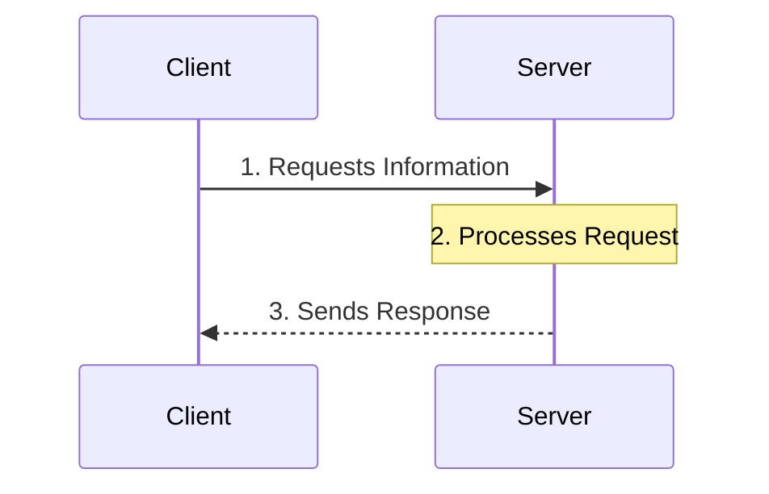
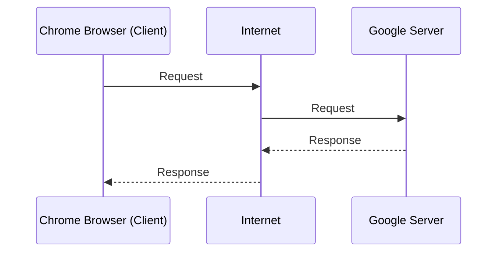
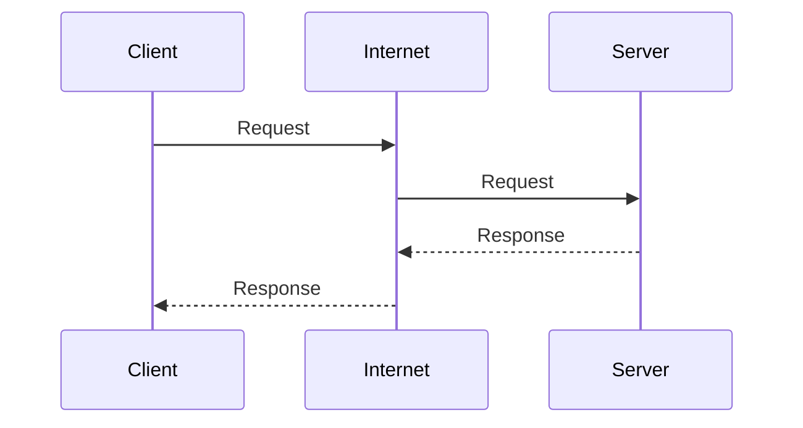
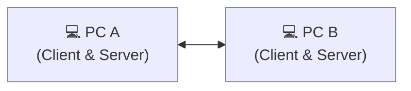
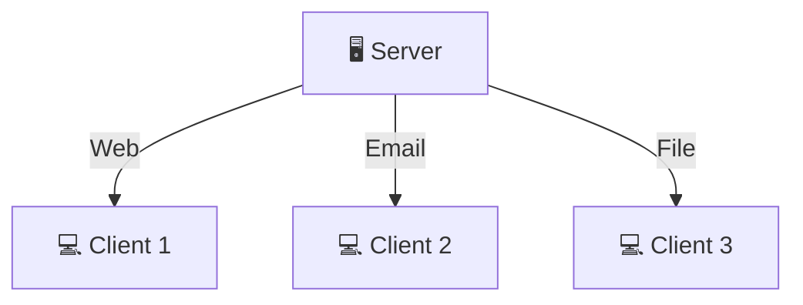
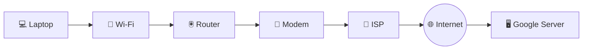
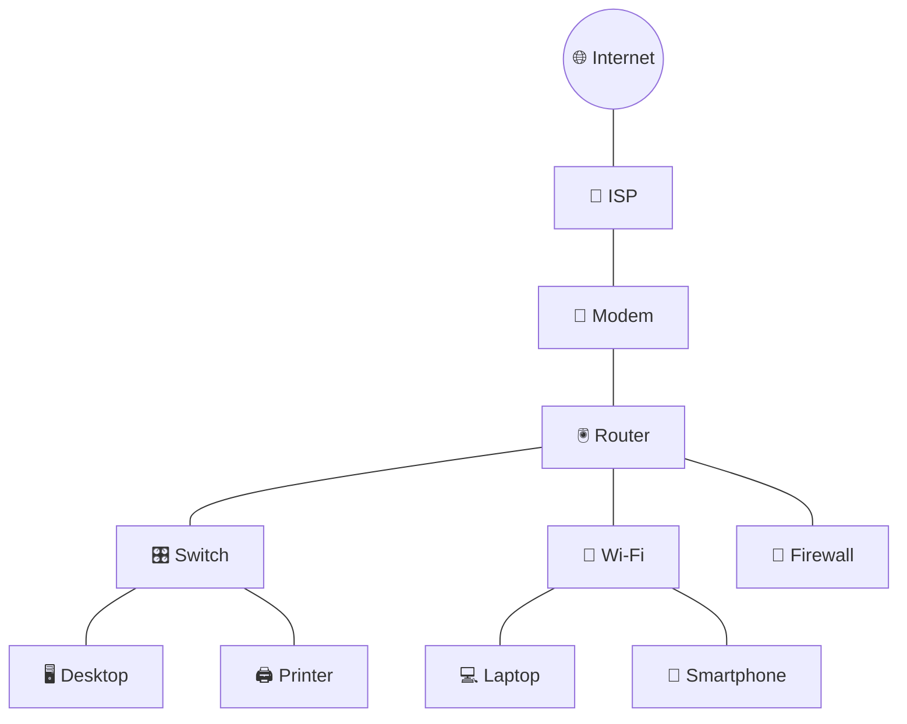
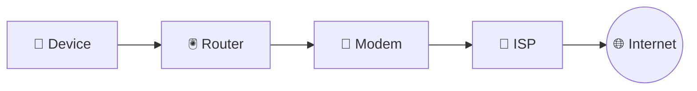
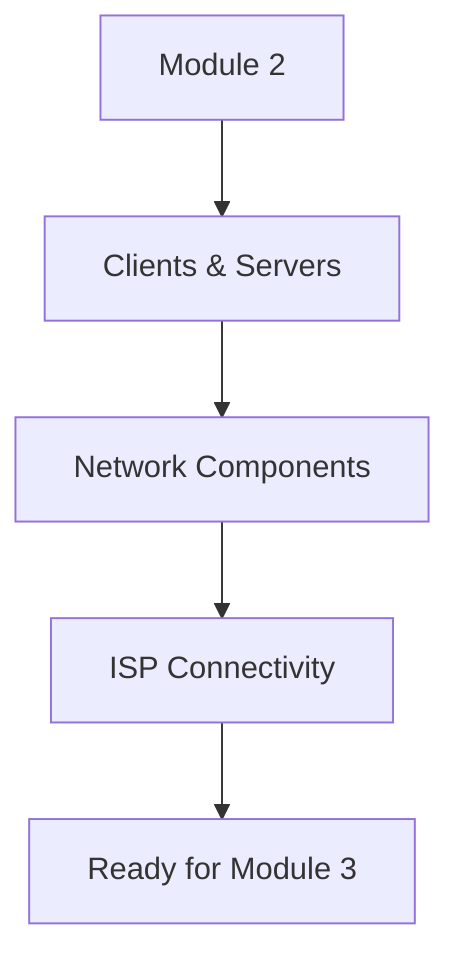
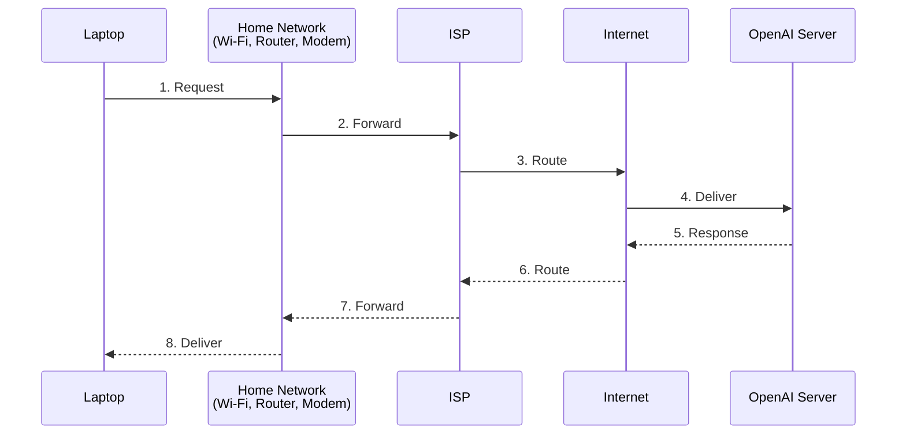

# 🌐 Module 2 – Network Components, Types, and Connections

**Course:** 📚 Networking Basics

### 🎯 Module Goal

This module explains how devices actually communicate on a network: the client/server and peer-to-peer models, the three building blocks of any network (end devices, intermediate devices, network media), and how a home network connects through a modem and router to an ISP and the wider Internet.

---

## 📖 Overview

- **What we cover:** Client/server roles, peer-to-peer networks and applications, standard network infrastructure symbols, end vs. intermediate devices, network media, ISP services, and common Internet connection technologies (cable, DSL, cellular, satellite, dial-up).
- **Why it matters:** Every later CCNA topic (addressing, switching, routing) assumes you already know which device does what job in a network.
- **Real-world application:** You'll use this whenever you diagram a network, choose between a modem and a router, decide if a small office needs a dedicated server or can use peer-to-peer sharing, or pick an Internet access technology for a location.

---

## 🖥️ Topic 1 – Clients, Servers, and Peer-to-Peer Networks

### 🤔 What is it?

When you open an app like YouTube, Gmail, or Netflix, your device doesn't do all the work itself — it asks another computer somewhere on the Internet for information. 
- The requesting computer is called a **client**. 
- The computer that answers is called a **server**. 

Almost every application follows this model. The **role** a computer plays is decided entirely by the software running on it, not by the hardware itself — the same laptop can be a client (running Chrome) and a server (running Apache) at the same time.

### ❓ Why do we need it?

Without the client/server model, there would be no websites, email, online games, cloud storage, or streaming. Just like a restaurant where a customer doesn't cook their own food, a client requests a service and a server processes and fulfills that request.

### ⚙️ How does it work?

**Opening a website, step by step:**

1. You type a web address (e.g. [www.youtube.com](http://www.youtube.com)).
2. Your browser (client software) sends a request.
3. The request reaches the destination web server.
4. The server finds the requested page.
5. The server sends the page back.
6. Your browser displays the webpage.

### 🔑 Key Components

- 💻 **Host:** Any device connected to a network that can send or receive data. Every client and every server is a host.
- 🙋 **Client:** A computer (or software) that requests information or services. *Client = Asks.*
- 💁 **Server:** A computer (or software) that provides information or services, usually running continuously so clients can reach it anytime. *Server = Answers.*
- **Client software examples:** Chrome, Firefox, Edge, Safari, Outlook.
- **Server software examples:** Apache HTTP Server, Nginx, Microsoft Exchange, file server software, database server software.

### 🗂️ Types

#### 🏢 Client–Server Model
- **Definition:** A dedicated server answers requests from many clients.
- **Characteristics:** Centralized resources; server runs continuously; clients initiate every request.
- **Example:** A college file server that thousands of student laptops (clients) connect to.

#### 🗄️ Server Types
- 📧 **Email Server:** Stores and manages emails. Client software: Outlook, Thunderbird, Apple Mail.
- 🌍 **Web Server:** Hosts websites. Client software: Chrome, Edge, Firefox, Safari.
- 📁 **File Server:** Stores files centrally so clients can access shared files over the network.

#### 🤝 Peer-to-Peer (P2P) Network
- **Definition:** A network with no dedicated server, where every computer is equal and can share its own resources (files, printers).
- **Characteristics:** Easy to set up, low cost, good for small/home networks; but has no centralized management, lower security, performance drops when a peer is busy, and doesn't scale well.
- **Example:** A home network where one PC shares a printer and another shares files, with no central server.

#### 🔄 Peer-to-Peer (P2P) Application
- **Definition:** A specific application where each device acts as both client and server during communication — different from a P2P *network*.
- **Characteristics:** Both devices send and receive simultaneously.
- **Example:** Instant messaging apps, BitTorrent, original Skype architecture, blockchain nodes, some multiplayer games.

#### 🎭 Multiple Roles
- **Definition:** One computer can run several server roles (web, email, file) at once, and one client can use several services at once.
- **Example:** A single server hosting web, email, and file services for Client1, Client2, and Client3 simultaneously; a single laptop watching YouTube, downloading a file, and receiving email at the same time.

### 📊 Diagrams

**Client–Server Model**

**Peer-to-Peer Communication**

**Multiple roles on one server**

> [!NOTE]  
> Communication sequence: the client sends a request → it travels through the network → the server receives and processes it → the server sends a response → the client displays the result.

### 🏫 Real-Life Example

A student's laptop (client) connects through college Wi-Fi to a college server that provides the student portal, attendance, assignments, and timetable — with thousands of students accessing the same server at once.

### 💡 Important Facts

> [!IMPORTANT]
> - A host is any network-connected device that can send or receive data.
> - The role of a device (client, server, or both) depends on the software it runs, not the hardware itself.
> - Servers typically run continuously so clients can reach them at any time.
> - A P2P network and a P2P application are different concepts even though both avoid a single dedicated server role.

### ❌ Common Beginner Mistakes

> [!WARNING]
> - **Mistake:** Believing a server is always a special, expensive computer.
>   **Correct understanding:** A server is any computer running server software — even a regular PC can become one.
> - **Mistake:** Thinking a client can only receive data.
>   **Correct understanding:** Clients send requests and receive responses.
> - **Mistake:** Assuming a computer can only be a client or a server, not both.
>   **Correct understanding:** A single computer can perform both roles at the same time.
> - **Mistake:** Treating P2P networks and P2P applications as the same thing.
>   **Correct understanding:** A P2P network has no dedicated server in the network; a P2P application lets individual devices act as both client and server during communication.

### ⚖️ Comparisons

| Feature | Client–Server Network 🏢 | Peer-to-Peer Network 🤝 |
| :--- | :--- | :--- |
| **Dedicated server?** | Yes | No |
| **Setup cost** | Higher | Lower |
| **Centralized management**| Yes | No |
| **Security** | Easier to manage centrally | Managed individually, generally weaker |
| **Scalability** | Good for large networks | Poor for large networks |

### 📝 Key Terms

| Term | Meaning |
| :--- | :--- |
| **Host** | Any network-connected device that can send or receive data |
| **Client** | A device/software that requests information or services |
| **Server** | A device/software that provides information or services |
| **P2P Network** | A network with no dedicated server; all devices are equal |
| **P2P Application**| An application where each device acts as both client and server |

> [!TIP]
> **Memory Tip – Restaurant Analogy 🍽️**
> - Customer = Client
> - Chef = Server
> - Food = Data
> - Order = Request
> - Served meal = Response

---

## 🏗️ Topic 2 – Network Components & ISP Connectivity

### 🤔 What is it?

A network is more than just computers connected together. It is built from three categories of parts: **end devices** (what users interact with), **intermediate devices** (which move, manage, and protect traffic), and **network media** (the paths data travels on). An **ISP (Internet Service Provider)** then connects a local network to the wider Internet.

### ❓ Why do we need it?

A laptop cannot directly talk to a server like Google's — the request must pass through several devices, each with a specific job. Understanding these roles is one of the most important CCNA foundations.

### ⚙️ How does it work?

**Opening [www.google.com](http://www.google.com), step by step:**

1. The laptop creates a request.
2. The request goes to the Wi-Fi router.
3. The router forwards it to the modem.
4. The modem sends it to the ISP.
5. The ISP forwards it through the Internet.
6. Google's server receives the request.
7. The response returns along the reverse path.

### 🔑 Key Components

- 📱 **End Devices:** Desktop, laptop, smartphone, tablet, printer, IP phone, security camera, barcode scanner, servers. 
  *Their job:* create or receive data ("source or destination of data"). Every end device needs an address (IP address, covered later) so the network knows where to send data.
- 🖲️ **Intermediate Devices:** Wireless router (connects wired/wireless devices, provides Internet access), LAN switch (connects devices inside a LAN), router (connects different networks), multilayer switch (a switch with routing capability, used in large enterprise networks), firewall appliance (provides security, filters/blocks unwanted traffic). 
  *Their job:* move, forward, protect, and manage data — they do not generate user data themselves.
- 📡 **Network Media:** Wireless media (Wi-Fi/radio waves), LAN media (usually Ethernet cable, short distance), WAN media (long-distance links between cities, countries, or ISPs). 
  *Their job:* carry the data.
- 🗺️ **Standard infrastructure symbols:** Router, wireless router, switch, and wireless access point icons represent intermediate devices; laptop, desktop, smartphone, printer, and IP phone icons represent end devices; LAN cable, WAN connection, wireless signal, and a cloud icon represent network media — these symbols appear throughout CCNA diagrams and Packet Tracer labs.

### 🗂️ Types

#### 🔌 Internet Connection Technologies

- 📺 **Cable Internet:** broadband delivered over television coaxial cable. High bandwidth, always connected, widely available; requires a cable modem.
- 📞 **DSL (Digital Subscriber Line):** broadband delivered over telephone lines. Always connected, phone and Internet can work simultaneously; speed decreases with distance from the telephone company's central office.
- 📱 **Cellular Internet:** Internet access via mobile towers (4G/5G). Works while traveling, wide coverage, no wired connection needed; may have data limits and speed depends on signal/congestion. Example: phone hotspot.
- 🛰️ **Satellite Internet:** Internet access via a satellite dish communicating with an orbiting satellite, which connects to the ISP. Excellent for remote areas; higher latency since signals travel thousands of kilometers, and can be affected by bad weather.
- ☎️ **Dial-Up Telephone:** the oldest Internet connection type, over a telephone line via a dial-up modem. Very inexpensive, works where no broadband exists; extremely slow, occupies the phone line during use, rarely used today.

#### 🏢 ISP Services

- **Web Hosting:** stores websites.
- **FTP Hosting:** stores downloadable files (e.g., software downloads).
- **Application & Media Hosting:** hosts cloud applications, video, and streaming services.
- **Technical Support:** helps customers troubleshoot Internet issues.
- **VoIP (Voice over IP):** Internet-based calling, e.g. WhatsApp calling, Zoom, Microsoft Teams.
- **POP (Point of Presence):** a local ISP facility where customer connections enter the provider's network.
- **Equipment Co-location:** customers rent space in an ISP's data center for their own networking equipment.

### 📊 Diagram Explanation

**Overall network infrastructure**

**Path to the Internet**

> [!NOTE]  
> Communication sequence: an end device creates a request → a switch (if used) forwards it within the LAN → the router sends it toward the ISP → the ISP carries it across the Internet → the destination server responds → the reply follows the reverse path.

### 🏠 Real-Life Example

A typical home network: laptop, phone, and smart TV all connect through one Wi-Fi router, which connects to a modem, which connects to the ISP, which connects to the Internet and services like Google, YouTube, or Netflix.

### 💡 Important Facts

> [!IMPORTANT]
> - Every network consists of end devices, intermediate devices, and network media.
> - End devices create and receive data; intermediate devices forward, manage, and secure traffic; network media carries the data.
> - A **modem** connects your home network to the ISP (one WAN connection); a **router** connects devices within your home network (many LAN connections). *Modem = main gate of the house; Router = hallway connecting all rooms.*
> - Internet access technologies include cable, DSL, cellular, satellite, and (historically) dial-up.
> - Most networking components are hardware; wireless media is the exception since the transmission path (radio waves) is invisible.

### ❌ Common Beginner Mistakes

> [!WARNING]
> - **Mistake:** Thinking a router and a modem are the same device.
>   **Correct understanding:** They have different roles, even though many home devices combine both into one unit.
> - **Mistake:** Believing a switch connects different networks.
>   **Correct understanding:** A switch mainly connects devices within the same LAN; routers connect different networks.
> - **Mistake:** Assuming end devices forward traffic.
>   **Correct understanding:** End devices generate or receive data; intermediate devices are responsible for forwarding traffic.
> - **Mistake:** Believing satellite Internet is always faster than cable.
>   **Correct understanding:** Satellite provides broadband in remote areas but usually has much higher latency than cable or fiber.

### ⚖️ Comparisons

| Feature | 🔌 Modem | 🖲️ Router |
| :--- | :--- | :--- |
| **Connects to** | The ISP | Devices inside your home |
| **Talks to** | ISP | Your devices |
| **Connection type**| One WAN connection | Many LAN connections |

**Internet Access Technologies:**

| Technology | Medium | Strength | Weakness |
| :--- | :--- | :--- | :--- |
| **Cable** | Coaxial TV cable | High bandwidth, widely available | Shared bandwidth in the neighborhood |
| **DSL** | Telephone line | Always connected, phone+Internet together | Speed drops with distance from exchange |
| **Cellular** | Mobile towers | Mobile, wide coverage | Data limits, variable speed |
| **Satellite**| Satellite dish | Works in remote areas | High latency, weather-sensitive |
| **Dial-up** | Telephone line | Cheap, works anywhere with a phone line | Extremely slow, ties up the phone line |

### 📝 Key Terms

| Term | Meaning |
| :--- | :--- |
| **End device** | A device that creates or receives data (source/destination) |
| **Intermediate device**| A device that forwards, manages, or secures traffic (router, switch, firewall) |
| **Network media** | The physical or wireless path that carries data |
| **ISP** | Internet Service Provider; connects a local network to the Internet |
| **Modem** | Device that connects a home network to the ISP |
| **Router** | Device that connects multiple devices/networks together |

> [!TIP]
> **Memory Tip – "E-I-M" 🧠**
> - **E**nd Devices → create/receive data
> - **I**ntermediate Devices → move/manage data
> - **M**edia → carry data
>
> **Path to remember:** *Device → Router → Modem → ISP → Internet*

---

## 🏁 Module Summary (Sections 2.4.1–2.4.2)

If Module 1 answered *"why do we need networks?"*, Module 2 answers *"what components make a network work?"* By the end of this module you should recognize: client, server, router, switch, modem, ISP, end device, and network media — the same way assembling furniture eventually reveals what each screw, bolt, and panel is for.

**Real-life walkthrough – opening ChatGPT at home:**

- The laptop is the **client**; the ChatGPT server is the **server**.
- The **router** directs traffic inside the home.
- The **modem** connects the home to the ISP.
- The **ISP** connects the home to the Internet.
- **Network media** (Wi-Fi, Ethernet, fiber) carries the data the whole way.

### 📚 Key Terms (Module-wide)

| Term | Meaning |
| :--- | :--- |
| **Host** | Any device that can send or receive data on a network |
| **Client** | Requests services |
| **Server** | Provides services |
| **P2P network** | No dedicated server; all devices equal |
| **End device** | Source or destination of data |
| **Intermediate device**| Forwards/manages/secures traffic |
| **Network media** | Carries data between devices |
| **ISP** | Connects a local network to the Internet |
| **Modem** | Connects the home to the ISP |
| **Router** | Connects devices/networks together |

### 🚀 Quick Revision

- A host is any network-connected device that can send or receive data.
- Clients request services; servers provide them — *"Client = Requests, Server = Responds."*
- The role of a device (client, server, or both) depends on the software running on it, not the hardware.
- A Peer-to-Peer network has no dedicated server; a Peer-to-Peer application lets each device act as both client and server.
- P2P networks are easy and cheap to set up but don't scale well and lack centralized security.
- Every network is built from end devices, intermediate devices, and network media.
- End devices (laptops, phones, printers) create and receive data; they don't forward traffic.
- Intermediate devices (routers, switches, firewalls) move, manage, and secure traffic without generating user data themselves.
- A switch connects devices within the same LAN; a router connects different networks.
- Network media carries data as wired (LAN/WAN) or wireless signals.
- A modem connects a home network to the ISP; a router connects devices inside the home — they are different functions even when combined into one box.
- ISPs provide more than just Internet access — web hosting, FTP hosting, VoIP, technical support, and equipment co-location are common services.
- Common Internet access technologies are cable, DSL, cellular, satellite, and dial-up, each with different speed, latency, and coverage trade-offs.
- Satellite Internet reaches remote areas but has much higher latency than cable or fiber.
- One server can support many clients at once, and one client can use multiple services at once.

### 🎓 Final Takeaways

- **Main concepts learned:** the client/server and peer-to-peer communication models; the three building blocks of any network (end devices, intermediate devices, network media); and how home networks connect to the Internet through a modem, router, and ISP.
- **Skills gained:** the ability to distinguish a client from a server, a P2P network from a P2P application, an end device from an intermediate device, and a modem from a router; and the ability to compare cable, DSL, cellular, satellite, and dial-up Internet access.
- **What the learner should now understand:** a network is not just "computers connected together" — it's a structured system of devices and media each playing a specific role, and an ISP is the bridge between a local network and the global Internet. This prepares the learner for upcoming modules on addressing and data forwarding.
